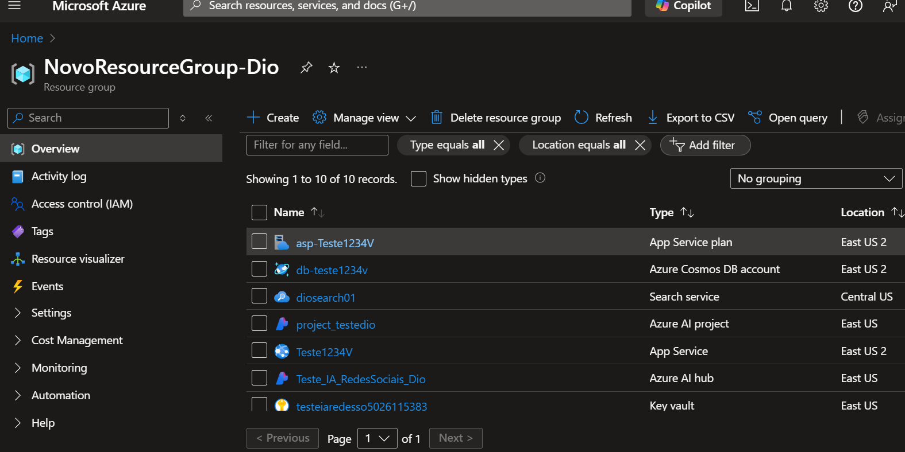
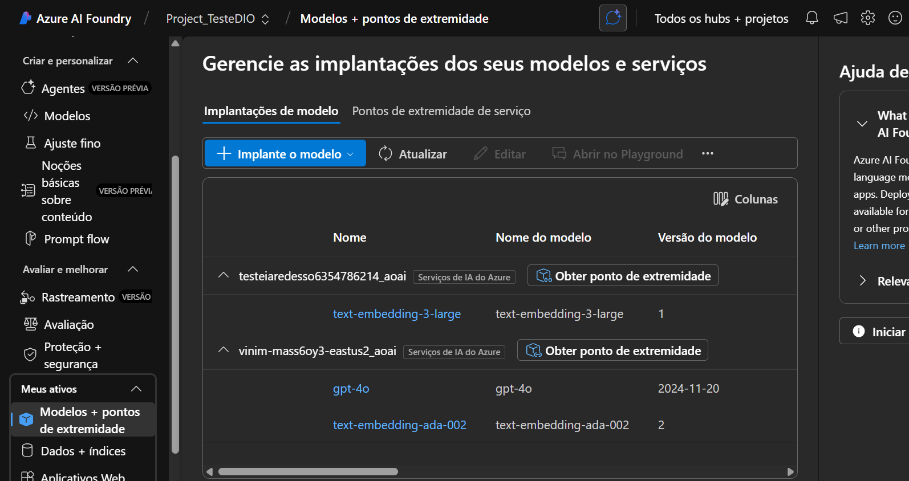
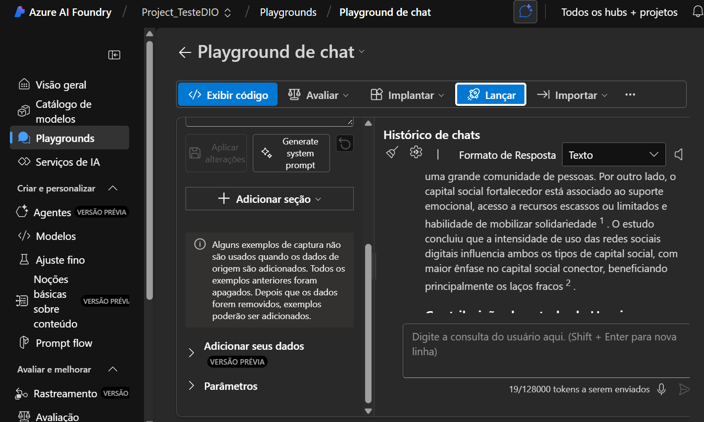
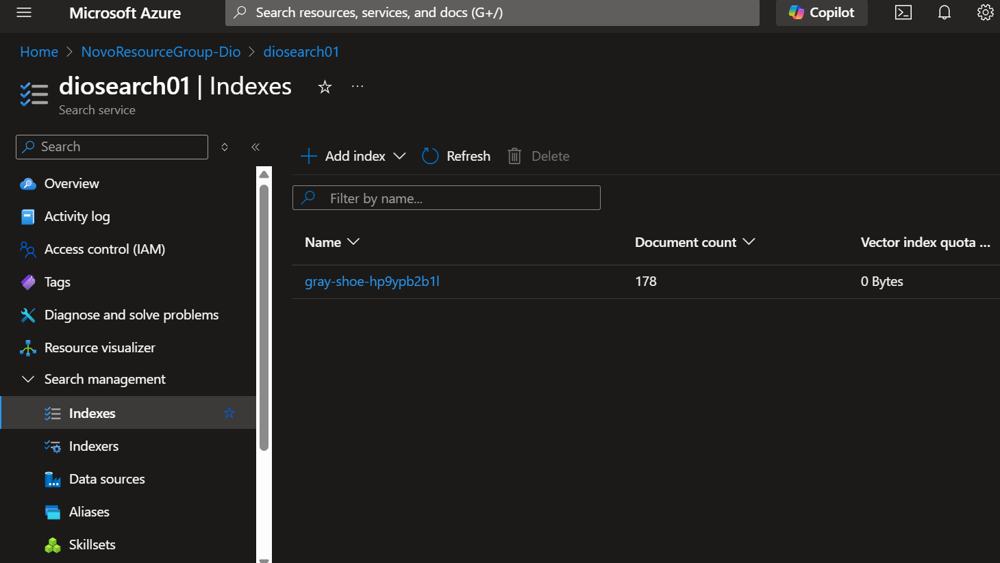
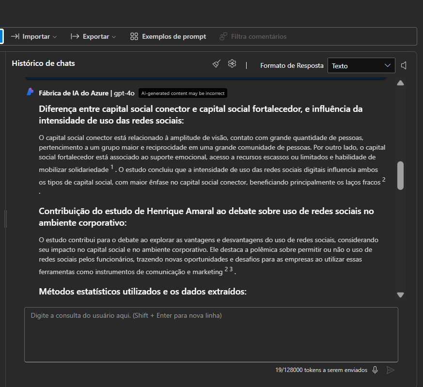
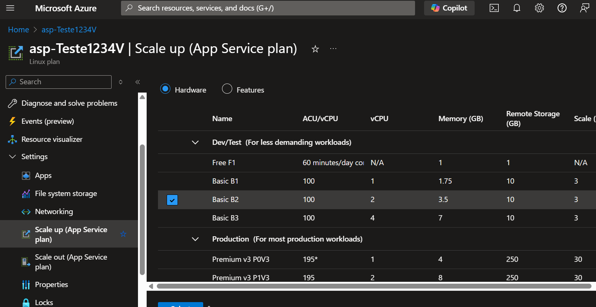

# Treinando_IAFoundryDIO
Treinando uma IA gpt_4o com PDFs para responder com base nos mesmos. 
Fiz um resumo do meu percurso em um caderno e passei a Limpo para um Chat de IA resumir e estruturar meu caminho durante o treinamento. Segue as informações:
markdown
Copiar
Editar
# 🧠 Experiência com Treinamento de IA no Azure AI Foundry

Este repositório documenta minha experiência ao configurar um ambiente de treinamento e implantação de modelos de IA utilizando o Azure AI Foundry. O objetivo foi testar um fluxo de trabalho completo envolvendo modelos da OpenAI (GPT-4o e text-embedding-3-large), upload de dados em PDF e implantação de um chat interativo via aplicativo web. Durante o processo, encontrei alguns desafios técnicos que também estão registrados aqui.

---

## 🚀 Etapas Realizadas

### 1. Criação dos Recursos Iniciais
- Criação de um **Resource Group** para centralizar os recursos do projeto.
- Criação de um **AI Foundry Hub** com o nome: `Teste_IA_RedesSociaisDio`.

**📸 Imagem 1 — Criação do Resource Group no portal do Azure:**
 

2. Implantação dos Modelos
Dentro do hub, acessei Modelos + Pontos de Extremidade.

Implantei os seguintes modelos:

gpt-4o

text-embedding-3-large

**📸 Imagem 2 — Tela de implantação dos modelos:**

md
Copiar
Editar

3. Configuração do Playground e Upload de Dados
Criei um Playground de Chat com o prompt inicial:

"Você é um assistente de IA que ajuda as pessoas a encontrar informações."

Carreguei arquivos em PDF com informações relevantes para os testes.

📸 Imagem 3 — Interface do Playground com o prompt configurado:

md
Copiar
Editar

4. Adição da Capacidade de Busca (Search)
Criei um recurso Azure AI Search como deployment.

Configurei o índice e as opções de busca.

Isso permitiu que perguntas relacionadas ao conteúdo dos PDFs fossem respondidas corretamente pela IA.

📸 Imagem 4 — Configuração do índice de busca:

md
Copiar
Editar

5. Testes com IA Externa
Usei um modelo externo para gerar perguntas sobre análise de redes sociais.

Encaminhei essas perguntas para a IA configurada no Azure e corrigi as respostas utilizando a IA externa como referência.

📸 Imagem 5 — Exemplo de interação com pergunta gerada externamente:

md
Copiar
Editar

🌐 Implantação do Chat como Aplicativo Web
Problema: Provedor Microsoft.Web não registrado
Durante a tentativa de implantação do aplicativo web, recebi a mensagem:

“Verifique se o provedor Microsoft.Web está registrado para sua assinatura.”

Solução:
Registrei o provedor manualmente usando o CLI do Azure:

bash
Copiar
Editar
az provider register --namespace Microsoft.Web
Escalonamento do App Service Plan
Escalei o plano de serviço de app da camada Basic B1 para Basic B2 na categoria Dev/Test.

📸 Imagem 7 — Escalonamento de serviço no portal:

md
Copiar
Editar

⚠️ Erro na Geração de Respostas do Web Chat
Mesmo com a implantação bem-sucedida, o chat apresentou erro ao tentar gerar respostas:

json
Copiar
Editar
Error: There was an error generating a response. Chat history can't be saved at this time.
Error code: 400 - {
  "error": {
    "requestid": "...",
    "code": "400",
    "message": "Failed to get managed identity token. Response: {
      \"error\": {
        \"code\": \"ManagedIdentityIsNotEnabled\",
        \"message\": \"Managed Identity (MI) is not set for this account while the encryption key source is 'Microsoft.KeyVault'...\"
      }
    }"
  }
}
Causa Provável
Uso de chave de criptografia gerenciada pelo cliente (Customer Managed Key);

Managed Identity (MI) não ativada;

Restrições de rede impedindo a autenticação.

Possíveis Soluções
Ativar Managed Identity no recurso afetado;

Garantir acesso ao Key Vault;

Verificar regras de segurança de rede;

Documentação do Azure Managed Identity

✅ Conclusão
A experiência mostrou ser possível treinar, configurar e implantar uma IA com dados próprios no Azure AI Foundry, utilizando modelos avançados da OpenAI. Apesar dos sucessos nas etapas de configuração e testes, a fase final de geração de respostas no aplicativo web apresentou um desafio de autenticação que ainda está sendo investigado.

📌 Observações Finais
Este repositório foi criado para fins de documentação e aprendizado. Caso você esteja enfrentando problemas similares, sinta-se à vontade para abrir uma issue ou contribuir com sugestões.

yaml
Copiar
Editar

---

### ✅ Próximo passo

Você pode:

1. Criar uma pasta chamada `imagens` no repositório.
2. Salvar as capturas de tela correspondentes com os nomes indicados.
3. Subir tudo junto com o `README.md`.

Se quiser, posso gerar esse `README.md` como um arquivo pronto para download. Deseja?
